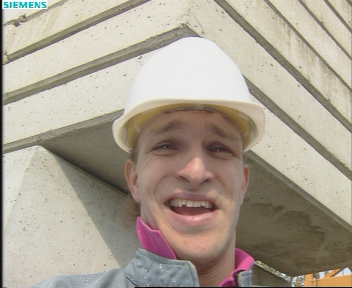
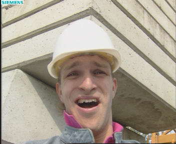
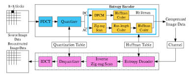
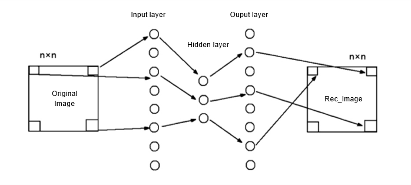
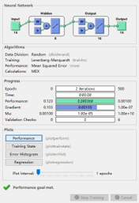
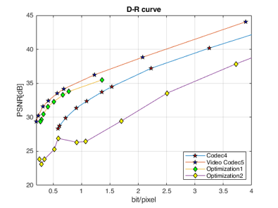

# BP network based video compression

## Contents  
- [Environment](#Environment)  
- [Structure](#Structure)  
- [Usage Description](#Usage-Description)
- [Dataset](#Dataset)   
- [Motion Compensation](#Motion-Compensation)
- [BP network Optimization](#BP-network-Optimization) 
- [Results](#Results) 
- [Copyright](#Copyright)

## Environment
* MATLAB R2020b
* Matlab Image Processing Toolbox, Deep Learning Toolbox
* The code is tested on Matlab R2020b, with operating system Windows.


## Structure

  ├── [Optimization1.m](./Optimization1.m): Deblockling Quantization Table and Deblocking filter in Baseline JPEG  
  ├── [Optimization2.m](./Optimization2.m): Image Compression Based on BP Neural Network  
  ├── [sequences](./sequences): Test Image Sequences  
  ├── [JPEG1.m](./JPEG1.m): Use the JPEG standard to compress the image.  
  ├── [BPNN2.m](./BPNN2.m): Compress Images using BP neural network.  
  ├── [deblocking_filter.m](./deblocking_filter.m): Compress Images using BP neural network.  
  ├── [chapter4.mat](./chapter4.mat): Save RD-Curve of chapter4 in mat form.  
  ├── [chapter5.mat](./chapter5.mat): Save RD-Curve of chapter5 in mat form.  
  ├── [Optimization1.mat](./Optimization1.mat): Save RD-Curve of Optimization1 in mat form.   
  └── [Optimization26.mat](./Optimization26.mat): Save RD-Curve of Optimization2 in mat form.    

## Usage Description
* Open Matlab.
* Click Browse for folder and add file to your workspace.
* Double-click the two Optimizition functions([Optimization1](./Optimization1),[Optimization2](./Optimization2)), all functions are displayed here.
* Enjoy and have fun! 

## Dataset
* The foreman image sequences will serve as examples to my project.  
* The compression results below are based on the foreman image [sequences](./sequences).  
   

## Motion Compensation
* The [first image](./foreman0020.bmp) in sequences is compressed and restored according to the [JPEG](./JPEG1.m) standard. And add [Deblocking filter](./deblocking_filter.m) to remove the block effect after image restoration.  
 [1]
* The [first image](./foreman0020.bmp) will be used as a reference for the [second image](./sequences/foreman20_40_RGB/foreman0021.bmp) to obtain Motion vectors (```motion_vectors2```)between the two images.
```
  ref_image1 = decoded_frame{1};                   
  curr_image2 = image_YCbCr{2};
  motion_vectors2 = SSD(ref_image1(:,:,1), curr_image2(:,:,1));
```
* The motion vectors (```motion_vectors2```) are stored and used to restore the [second image](./sequences/foreman20_40_RGB/foreman0021.bmp) together with the [first image](./foreman0020.bmp). The difference (```err_image2```) between the restored second image and the real [second image](./sequences/foreman20_40_RGB/foreman0021.bmp) will also be saved as the compressed memory of the second image.
```
  rec_image2 = SSD_rec(ref_image1, motion_vectors2);             
  err_image2 = curr_image2 - rec_image2; 
```
* The final restoration of the second image will use the [first image](./foreman0020.bmp) as a reference, plus the Motion vectors (```motion_vectors2```) and difference (```err_image2```)for both images.
```
  decoded_frame{i} = SSD_rec(ref_image, motion_vectors_rec) + err_rec;
```
* In this way the entire [sequences](./sequences) can be efficiently compressed.
* Use the Huffman to encode and transmit the content that needs to be stored. And vice versa for decoding.
```
  k_err2= IntraEncode(err_image2,qScale);
  pmf_mo = stats_marg(motion_vectors2(:), (1:81));
  [BinaryTree_mo, BinCode_mo, Codelengths_mo] = buildHuffman(pmf_mo);
  pmf_err = stats_marg(k_err2,range);% according to requirement.
  [BinaryTree_err, BinCode_err, Codelengths_err] = buildHuffman(pmf_err);
```

## BP network Optimization
* Based on [Optimization1](./Optimization1.m), the [JPEG](./JPEG1.m) standard is improved. [BP](./BPNN2.m) is introduced as a method for compressing and restoring images.  
```
  [image_rec,bit] = BPNN2(image_YCbCr{1},4,8); [3]
```
* Because the number of hidden layers of the neural network is smaller than the number of input layers, the image compression can be achieved by saving the hidden layer weights and hidden layer outputs.  
[2]
* The execution speed is also improved compared to [Optimization1](./Optimization1.m).
```
  Tested on laptop
  Elapsed time is 1104.390321 seconds.(Optimization1)
  Elapsed time is 475.909190 seconds.(Optimization2)

```

## Results



## Copyright
* [1][Fu Q, Jiang B, Wang C Y, et al. A Novel Deblocking Quantization Table for Luminance Component in Baseline JPEG[J]. J. Commun., 2015, 10(8): 629-637](http://www.jocm.us/uploadfile/2015/0824/20150824112248702.pdf)
* [2][刘光宇,曹禹,黄懿,曾志勇,赵恩铭,邢传玺.基于BP神经网络结构的图像压缩技术研究[J].牡丹江师范学院学报(自然科学版),2021(02):23-29.](https://kns.cnki.net/kcms/detail/detail.aspx?dbcode=CJFD&dbname=CJFDLAST2021&filename=MDJZ202102007&uniplatform=NZKPT&v=AifrAVbP0ayPVJ83VzR-QpNuDqG54t-n1tFnbqnaom17tJBVvO4oBrT-5qbD2nPS)
* [3][MATLAB实现基于BP神经网络的图像压缩](https://blog.csdn.net/yitian_z/article/details/103099568)